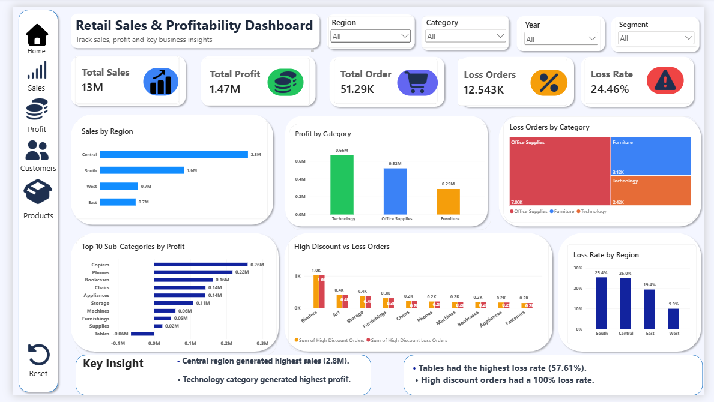

# Retail Sales & Profitability Analysis

## 📊 Project Overview

This project analyzes retail sales data to understand sales performance, profitability, loss orders, regional performance, product performance, and discount-related loss patterns.

The project uses **Excel, SQL, and Power BI** to clean, analyze, and visualize the data and generate meaningful business insights.

## 🛠️ Tools & Technologies

* **Excel** – Data cleaning, calculations and analysis
* **SQL** – Data analysis and business queries
* **Power BI** – Interactive dashboard and data visualization
* **CSV** – Dataset format

## 📁 Dataset

The dataset used in this project was sourced from Kaggle.

**Dataset:** Superstore Sales Dataset
**Source:** [Kaggle – Superstore Sales Dataset](https://www.kaggle.com/datasets/aashwinkumar/superstore-sales-dataset)

The dataset contains **51,290 retail transaction records** used for sales, profitability, regional, category, sub-category, discount, and loss analysis.

### Key Columns

* Order ID
* Order Date
* Ship Date
* Ship Mode
* Customer Name
* Segment
* State
* Country
* Market
* Region
* Product ID
* Category
* Sub-Category
* Product Name
* Sales
* Quantity
* Discount
* Profit
* Shipping Cost
* Order Priority
* Year

## 🔍 Analysis Performed

* Sales performance by region
* Profit by category
* Loss orders by category
* Profitability by sub-category
* Loss rate by region
* High-discount orders and loss orders
* Shipping time analysis
* Overall sales and profit performance

## 📈 Key Business Metrics

| Metric                 |         Value |
| ---------------------- | ------------: |
| Total Sales            |   **$12.64M** |
| Total Profit           |    **$1.47M** |
| Total Orders           |    **51,290** |
| Average Sales / Order  |   **$246.50** |
| Average Profit / Order |    **$28.64** |
| Loss Orders            |    **12,543** |
| Overall Loss Rate      |    **24.46%** |
| Average Shipping Time  | **3.97 Days** |

## 💡 Key Insights

* **Central region** generated the highest sales at approximately **$2.8M**.
* **Technology** generated the highest profit among the three categories.
* **Office Supplies** had the highest number of loss orders.
* **Copiers** were the most profitable sub-category by total profit.
* **Tables** had the highest loss rate at **57.61%**.
* Orders with discounts above **50%** had a **100% loss rate** in this dataset.
* High discounts and losses show a strong association in this dataset; this does not establish that discounts directly caused the losses.

## 📊 Power BI Dashboard

The interactive Power BI dashboard includes:

* Total Sales
* Total Profit
* Total Orders
* Loss Orders
* Overall Loss Rate
* Sales by Region
* Profit by Category
* Loss Orders by Category
* Top 10 Sub-Categories by Profit
* High Discount vs Loss Orders
* Loss Rate by Region
* Key Business Insights

## 🖼️ Dashboard Preview

## 🎯 Business Value

This analysis helps identify:

* High-performing regions
* Profitable and loss-making products
* Categories with high loss exposure
* Sub-categories requiring attention
* Regional profitability differences
* Potential risks associated with heavy discounting

## 📌 Conclusion

This project demonstrates how retail transaction data can be transformed into meaningful business insights using **Excel, SQL, and Power BI**.

The analysis highlights key areas of sales performance, profitability, loss management, and discount-related patterns to support better business decision-making.

## 👨‍💻 Author

**Devendra Kumar Saini**

Aspiring Data Analyst | SQL | Power BI | Excel | Data Analysis
